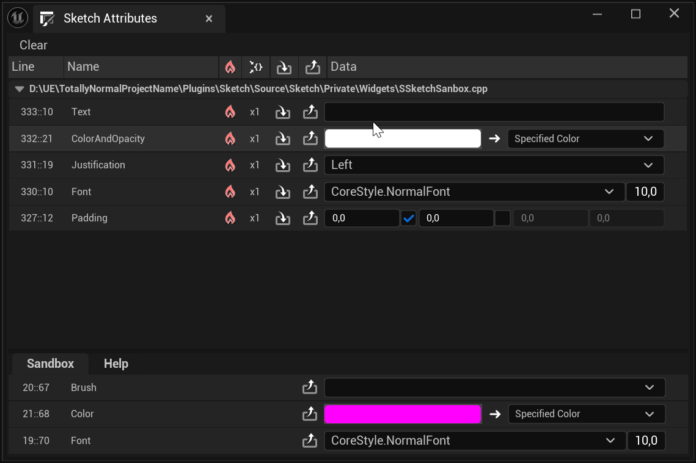
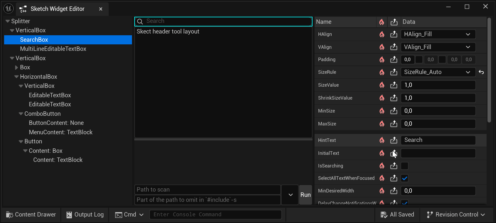
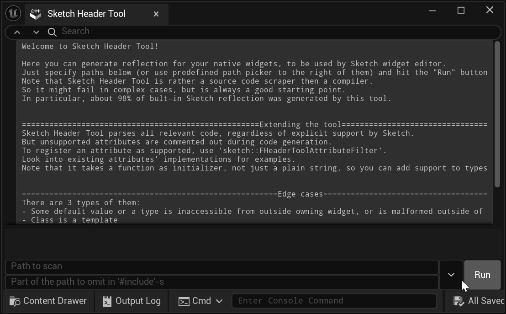

# Quick start
1. Install the plugin
2. Add `Sketch.SetupFor(this, Target);` to your `Module.Build.cs`
3. Add `#include "Sketch.h"` to your `cpp` file
4. Replace any constant in this `cpp` file with `Sketch("VarName", %default_variable_value%)`
5. Run your code and open `Tools->Sketch->SketchAttributes` to edit it

Note: Sketch Attributes window is also accessible globally through `Ctrl + Alt + Shift + W`; chord
can be customized via editor settings.

# Features
- Interactive editor for normally unreachable things and common stuff picker - colors (including
  Slate), fonts, icons
  
- WYSIWYG Slate editor
  
- Slate widget reflection generator
  
- Export of values and designs as code to clipboard or directly into source file

Detailed info on API or extensions can be found inside relevant plugin windows or here:
- [Sketch attributes](https://github.com/danillissimo/Sketch/blob/0fb512625e76abe6cf05826a192ea407ba0c5c74/Source/Sketch/Private/Widgets/SSketchSanbox.cpp#L46)
- [Sketch widget editor](https://github.com/danillissimo/Sketch/blob/0fb512625e76abe6cf05826a192ea407ba0c5c74/Source/Sketch/Private/Widgets/SSketchWidgetEditor.cpp#L21)
- [Sketch header tool](https://github.com/danillissimo/Sketch/blob/0fb512625e76abe6cf05826a192ea407ba0c5c74/Source/Sketch/Private/Widgets/SSketchHeaderTool.cpp#L21)

# Purpose
Sketch is a tool for un-hardcoding things.
Its target audience is Slate designers, but can also come in handy for any other programmers.
It was developed to enable designing Slate UIs in a more natural way - the way UMG and all other
things in Unreal are designed.
To achieve it, it provides a special function - [`Sketch`](https://github.com/danillissimo/Sketch/blob/0fb512625e76abe6cf05826a192ea407ba0c5c74/Source/Sketch/Public/Sketch.h#L13) -
all invocations of which are collected in a single place - Sketch attributes window in particular -
where values returned by each individual invocation can be controlled in real time.
It's not limited by Slate of course, and can control any values you like.
And, on top of it - it can export any customized values as code, and not only to clipboard, but
direclty into source code files.
Be careful with that feature though, as it can overwrite your unsaved changes.
Note that Sketch attributes window also contains palette of frequently needed pickers like colors,
fonts, and icons at the bottom.

To improve Slate designing experience even further, Sketch provides a UMG-like editor for Slate,
able to build Slate designs not only within its main window, but literally anywhere you want it to,
and in real time.
Similarly to Sketch attributes, created designs can be exported as code.
Sketch also provides Slate widget reflection generator, so any Slate widgets can be linked to it in
a pair of clicks, rather than by describing everything manually.
Details can be found inside Sketch widget editor and Sketch header tool windows.

# Internal features
Not that important, but might be of use:
- [Extensible compile-time pattern-matcher](https://github.com/danillissimo/Sketch/blob/0fb512625e76abe6cf05826a192ea407ba0c5c74/Source/Sketch/Public/HeaderTool/SourceCodeUtility.h#L873)
- [C++ source code scraper](https://github.com/danillissimo/Sketch/blob/main/Source/Sketch/Public/HeaderTool/SourceCodeUtility.h)
- [Live code to string converter](https://github.com/danillissimo/Sketch/blob/0fb512625e76abe6cf05826a192ea407ba0c5c74/Source/Sketch/Private/HeaderTool/SketchHeaderTool.cpp#L19) - technique of validation of code that will be compiled later as a
  part of generated code, but is validated by compiler during compilation of code generator, and
  references to which are visible to classic coding assistants
- "[Magic-enum](https://github.com/Neargye/magic_enum)"-like [compile-time enum reflection](https://github.com/danillissimo/Sketch/blob/main/Source/Sketch/Private/AttributesTraites/EnumerationTraits.cpp)
- [`SL`](https://github.com/danillissimo/Sketch/blob/main/Source/Sketch/Public/SketchStringLiteral.h) -
  macro to be used as a prefix for strings to replace bulky Unreal `TEXT` macro